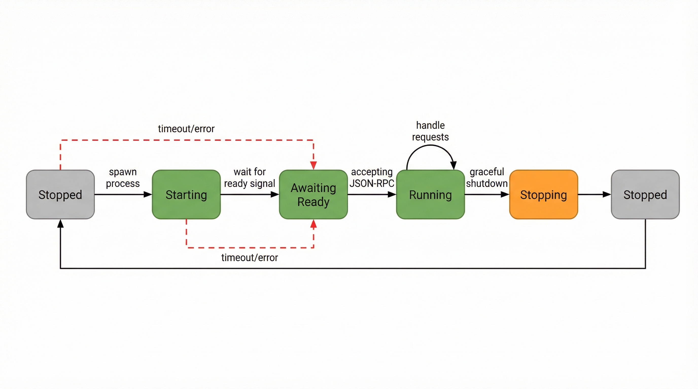
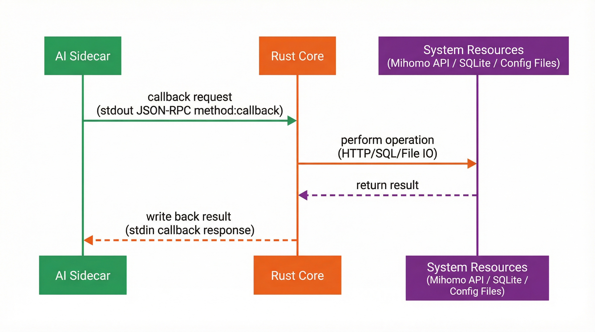
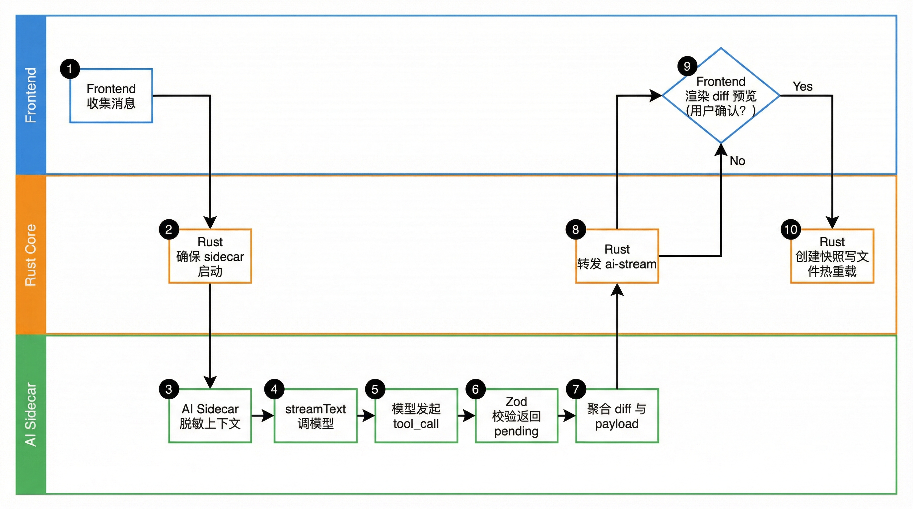

# AI Sidecar

ClashMind 的 AI 能力不是前端直接请求模型，也不是把模型 SDK 塞进 Tauri 主进程。
当前实现采用独立的 Node.js sidecar：Rust 负责启动、停止、超时、回调和事件转发，AI sidecar 负责 Provider 适配、Function Calling、配置预览和安全校验。

如果你还没有理解整个应用分层，建议先看 [系统架构](./architecture.md)。
如果你准备继续改 AI 相关代码，再配合 [开发指南](./development.md) 一起看会更顺手。

:::tip 阅读目标
这页重点解释 4 件事：AI sidecar 为什么独立存在、Rust 和 sidecar 怎么通信、Provider 与工具如何组织、以及当前实现为什么能做到“AI 可用但不越权”。
:::

## AI Sidecar 的角色

可以把 AI sidecar 看成一个受控的模型执行层。
它接收来自 Rust 的 JSON-RPC 请求，决定该调用哪个 Provider、要不要启用工具、如何把流式输出拆成事件，以及什么时候需要生成配置 diff 等待确认；它不直接拥有系统权限，也不直接持有“配置文件可以随便改”的权力。

从工程分工上看：

| 层 | 主要职责 |
|------|------|
| React 前端 | 聊天 UI、设置表单、事件展示、Diff 预览 |
| Rust / Tauri | Sidecar 生命周期、配置文件、Mihomo API、SQLite、Tauri event |
| AI Sidecar | Provider 适配、`streamText`、工具集、安全层、报告生成 |

这套分工的关键收益不是“模块划分更漂亮”，而是把模型行为和系统行为隔开。模型只能提议变更，真正的文件写入、快照创建和热重载仍由 Rust 执行。

## 为什么独立成单独进程

把 AI 功能独立成 sidecar，主要是为了同时满足三个目标：

1. 模型 SDK、流式处理和 Function Calling 留在最适合的 Node.js 生态里。
2. Rust 继续扮演系统中控，而不是变成一个同时管 Tauri、SQLite、HTTP、WS 和模型 SDK 的大进程。
3. 敏感能力通过受控 callback 暴露给 AI，而不是反过来让 AI 直接碰系统边界。

构建脚本也能看出这个意图。`ai-service/build.mjs` 会把入口文件打包成平台相关的单文件可执行程序，并发布到 Tauri sidecar 目录：

```js
const outputFile = resolve(
  PROJECT_ROOT,
  "..",
  "src-tauri",
  "binaries",
  `ai-service-${triple}${isWindows ? ".exe" : ""}`,
);
```

因此开发和打包时，Tauri 实际启动的是 `src-tauri/binaries/` 下的 sidecar 二进制，而不是直接跑一个裸的 Node 脚本。

## 当前目录结构

`ai-service/src/` 的职责分布很清楚：

| 路径 | 作用 |
|------|------|
| `index.ts` | 进程入口，逐行读取 stdin，并发送 `ready` |
| `rpc-handler.ts` | JSON-RPC 路由、chat/test/list/report handler |
| `providers/index.ts` | Provider 工厂和模型列表获取 |
| `tools/` | 配置、代理、统计、诊断工具 |
| `safety/` | 脱敏、Schema 校验、Diff 生成 |
| `prompts/` | 系统提示词、few-shot 和报告提示词 |
| `types.ts` | Zod schema 与 RPC / stream 类型 |

这个目录划分本身就是对 AI 工作流的拆解：入口只做协议和进程交互，`rpc-handler.ts` 只做请求分发，Provider、工具和安全逻辑各自留在单独模块里。

## 生命周期：由 Rust 统一管理



AI sidecar 的生命周期不由前端直接控制，而是由 Rust 侧的 `AiSidecarState` 管理。真实代码里，Rust 会维护当前 runtime 和自增请求 ID：

```rust
pub struct AiSidecarState {
    runtime: Arc<Mutex<Option<AiSidecarRuntime>>>,
    next_request_id: AtomicU64,
}

impl AiSidecarState {
    pub fn new() -> Self {
        Self {
            runtime: Arc::new(Mutex::new(None)),
            next_request_id: AtomicU64::new(1),
        }
    }

    pub fn is_running(&self) -> bool {
        self.runtime
            .lock()
            .map(|runtime| runtime.is_some())
            .unwrap_or(false)
    }
}
```

这说明 AI sidecar 被当作长期受管进程，而不是“每次聊天临时起一个子进程”。Rust 侧天然掌握请求时序、超时、退出清理和 event 转发，这正是系统中控应该做的事。

Rust 侧还负责等待 `ready` 信号、追踪 pending 请求、解析 stdout 每一行 JSON，并把 sidecar 流式事件转成前端可监听的 `ai-stream`。

## 启动握手：`ready` 信号

AI sidecar 启动时会立即向 stdout 发一条 `ready` 消息。入口文件是逐行监听 stdin 的：

```ts
const rl = createInterface({
  input: process.stdin,
  crlfDelay: Infinity,
  terminal: false,
});

writeMessage({
  jsonrpc: "2.0",
  method: "ready",
  params: {
    version: SERVICE_VERSION,
  },
});
```

Rust 侧收到这条消息后，才能把 sidecar 视为“真正就绪”。如果在超时时间内没有收到，Rust 会把它视为启动失败，而不是继续盲发请求。

## 通信协议：JSON-RPC over stdin/stdout

AI sidecar 与 Rust 之间使用 JSON-RPC 2.0，但通道不是 HTTP，而是标准输入输出。每一行是一条独立 JSON，这让协议层很轻，但已经足够支持普通请求 / 响应、流式事件输出，以及 sidecar 反向 callback 给 Rust。

入口文件会把读到的每一行解析成 JSON，再交给 `handleRpcMessage`：

```ts
rl.on("line", async (line: string) => {
  const trimmed = line.trim();
  if (!trimmed) {
    return;
  }

  let request: unknown;
  try {
    request = JSON.parse(trimmed);
  } catch {
    writeParseError();
    return;
  }

  const response = await handleRpcMessage(request);
  if (response !== null) {
    writeMessage(response);
  }
});
```

这种协议形态的优点在于：sidecar 不需要额外开 HTTP 端口，Rust 不需要内嵌一个复杂 RPC 客户端，进程之间的边界也非常清楚，任何消息都能直接从日志中观察。

## 当前暴露的 RPC 方法

`rpc-handler.ts` 当前实际注册的方法包括：

| 方法 | 用途 |
|------|------|
| `ping` | 健康检查 |
| `echo` | 协议调试 |
| `chat` | AI 对话主链路 |
| `test_connection` | Provider 连通性测试 |
| `list_models` | 拉取或回退模型列表 |
| `generate_report` | 生成日报 / 周报 |

其中 `chat` 是最复杂、最关键的一条链路；`test_connection` 与 `list_models` 主要配合设置页；`generate_report` 则用来基于统计数据生成自然语言报告。

## 流式事件格式

AI sidecar 并不是一次性返回整段文本，而是输出流式事件。`types.ts` 对事件有显式 schema：

```ts
export const streamEventSchema = z.discriminatedUnion("type", [
  textDeltaEventSchema,
  toolCallEventSchema,
  toolResultEventSchema,
  errorEventSchema,
  doneEventSchema,
]);
```

因此 Rust 和前端能稳定处理 `text_delta`、`tool_call`、`tool_result`、`error` 和 `done` 这几类事件。这套类型设计让“文本输出”和“工具结果”能走同一条流，前端不需要自己维护两套通道。

## Rust callback：AI sidecar 不直接碰系统边界



AI sidecar 自己不直接读配置文件，也不直接访问 Mihomo API。它通过一个 callback 机制，把这些受控能力向 Rust 请求。`tools/rust-rpc.ts` 的核心实现如下：

```ts
export function requestFromRust<TResult = unknown>(
  method: string,
  params: RustCallbackParams = {},
): Promise<TResult> {
  const callbackId = crypto.randomUUID();

  return new Promise<TResult>((resolve, reject) => {
    pendingCallbacks.set(callbackId, {
      method,
      timeout,
      resolve(result) {
        resolve(result as TResult);
      },
      reject,
    });

    process.stdout.write(
      `${JSON.stringify({
        jsonrpc: "2.0",
        id: callbackId,
        method: "callback",
        params: {
          callbackId,
          method,
          params,
        },
      })}\n`,
    );
  });
}
```

这意味着 sidecar 不需要知道配置文件真实路径、Mihomo API 地址和 secret，也不需要了解 SQLite 查询实现。它只需要知道“我要什么能力”，而不是“系统内部怎么做”。

### 当前可用的 callback 能力

Rust 侧目前已经为 AI sidecar 暴露了一组受控 callback，包括 `get_config`、`get_config_file`、`read_active_config_file`、`read_active_runtime_config`、`get_proxies`、`test_delay`、`get_stats_overview`、`get_domain_stats`、`get_traffic_trend`、`check_connectivity`、`get_recent_errors`、`get_rule_stats` 和 `get_report_stats`。这些能力正好覆盖了对话、诊断和报告最常见的上下文需求。

## Provider 适配

当前真实实现支持 4 类 Provider，而不是旧设计文档里常见的其他枚举：

```ts
export const providerIdSchema = z.enum(["openai", "openai_compatible", "claude", "gemini"]);
```

这也是继续开发时应该对齐的事实来源。

### Provider 一览

| Provider | 含义 |
|------|------|
| `openai` | OpenAI 官方接口 |
| `openai_compatible` | 兼容 OpenAI API 的服务或网关 |
| `claude` | Anthropic Claude |
| `gemini` | Google Gemini |

Provider 工厂实际由 `providers/index.ts` 管理：

```ts
export function createModel(settings: ProviderSettings): LanguageModel {
  switch (settings.provider) {
    case "openai": {
      const openai = createOpenAI({
        ...(apiKey ? { apiKey } : {}),
        ...(baseUrl ? { baseURL: baseUrl } : {}),
      });
      return openai(settings.model);
    }
    case "openai_compatible": {
      const compatible = createOpenAI({
        ...(apiKey ? { apiKey } : {}),
        baseURL: baseUrl,
      });
      return compatible.chat(settings.model);
    }
    case "claude": {
      const anthropic = createAnthropic({
        ...(apiKey ? { apiKey } : {}),
        ...(baseUrl ? { baseURL: baseUrl } : {}),
      });
      return anthropic(settings.model);
    }
    case "gemini": {
      const google = createGoogleGenerativeAI({
        ...(apiKey ? { apiKey } : {}),
        ...(baseUrl ? { baseURL: baseUrl } : {}),
      });
      return google(settings.model);
    }
  }
}
```

这里最值得记住的细节是 `openai_compatible` 分支使用 `compatible.chat(settings.model)`。源码注释已经解释过原因：不少兼容网关只实现 chat completions，不一定完整实现新接口。

### 模型列表获取与回退

Provider 层除了创建模型，还负责拉取远端模型列表。当前实现会根据 Provider 自动选择不同接口，也会在当前 Provider 缺少必填配置、远端接口返回空列表、或拉取过程中出现网络 / 认证错误时回退到内置模型列表或空结果。

因此设置页能区分：

- `remote`：远端模型列表获取成功
- `fallback`：回退到内置列表
- `empty`：当前配置不足以拉取远端列表

:::tip `openai_compatible` 的实际使用方式
这个枚举不是某个固定供应商，而是一类接口兼容形态，因此通常需要你自己填写 `Base URL`，很多时候也要自己知道可用模型名。
:::

## 工具概览

AI sidecar 的工具不是零散 helper，而是按职责分组，再统一拼成一个 `ToolSet`：

```ts
export const allTools = {
  ...configTools,
  ...proxyTools,
  ...statsTools,
  ...diagnosisTools,
} satisfies ToolSet;
```

### 配置工具

配置工具是 AI 工作流的核心。它们的关键点不是“直接改配置”，而是“先返回待确认操作”。例如：

```ts
add_proxy: tool({
  description: "添加代理节点到 Mihomo 配置，返回待确认操作",
  inputSchema: addProxyParameters,
  execute: async (params) =>
    finalizeValidatedChange(
      "add_proxy",
      params,
      validateProxyFragment(buildProxyFragment(params)),
    ),
}),
```

当前配置工具大致覆盖获取当前配置、添加 / 删除代理、添加 / 更新代理组、添加 / 删除规则、更新 DNS 和切换运行模式。

### 代理工具

代理工具覆盖运行时操作：`list_proxies`、`switch_proxy`、`test_delay`。其中 `switch_proxy` 同样被设计成待确认结果，说明项目对“AI 直接执行运行时变更”保持保守策略。

### 统计工具

统计工具让模型读取结构化事实，而不是凭空总结：`get_traffic_summary`、`get_top_domains`、`get_traffic_trend`。

### 诊断工具

诊断工具面向“哪里不对劲”这类问题：`check_connectivity`、`get_recent_errors`、`get_rule_match_stats`。把统计和诊断工具分开，是为了让“报告生成”和“运行排障”各自拥有更清晰的上下文。

## `chat` 的真实执行链路

AI 对话入口在 `rpc-handler.ts` 里。当前实现通过 `streamText` 调模型，并把工具、温度、token 上限一起带进去：

```ts
const result = streamText({
  model: createModel(chatParams.settings),
  system: prompt.system,
  messages: prompt.messages,
  tools: allTools,
  stopWhen: stepCountIs(5),
  ...(chatParams.settings.maxTokens === undefined
    ? {}
    : { maxOutputTokens: chatParams.settings.maxTokens }),
  ...(chatParams.settings.temperature === undefined
    ? {}
    : { temperature: chatParams.settings.temperature }),
});
```

这段代码说明当前 AI 对话是流式的，工具调用是主链路的一部分，代码显式限制了执行步数，模型参数也来自设置页而不是写死在 sidecar 中。随后 `fullStream` 会被拆成文本、工具调用、工具结果、错误和完成事件，并逐条写回 Rust。

## 安全机制

AI sidecar 真正有价值的地方，不只是“能接模型”，而是“能在本地系统里以受控方式接模型”。当前实现至少有 4 层安全机制。

### 1. 输入与上下文脱敏

如果聊天上下文里包含当前配置文本，sidecar 会先做脱敏再拼 prompt：

```ts
const sanitizer = new ConfigSanitizer();
let sanitizedContext = chatParams.context;

if (chatParams.context?.currentConfig !== undefined) {
  const sanitizedResult = sanitizer.sanitize(chatParams.context.currentConfig);
  sanitizedContext = {
    ...chatParams.context,
    currentConfig: sanitizedResult.sanitized,
  };
}
```

脱敏器会把代理中的敏感字段替换成占位符：

```ts
const SENSITIVE_PROXY_FIELDS = [
  "server",
  "password",
  "uuid",
  "key",
  "private-key",
  "public-key",
  "pre-shared-key",
  "token",
  "obfs-password",
] as const;
```

其中 `server` 会被替换为 `SERVER_n`，其他敏感值会被替换为 `[REDACTED]`。

### 2. Zod Schema 校验

AI 生成的配置片段不会直接信任。每类配置片段都有 Zod schema，例如代理节点：

```ts
const proxyBaseSchema = z
  .object({
    name: z.string().min(1, "代理节点名称不能为空"),
    type: z.enum(PROXY_TYPES),
    server: z.string().min(1, "服务器地址不能为空"),
    port: z.number().int().min(1).max(65535),
  })
  .passthrough();
```

更上层还存在整份 Mihomo 配置 schema，用于在应用前再做一次总体校验。

### 3. Diff 预览

当工具结果属于待确认配置变更时，`chat` handler 不会直接返回“已经成功”，而是先调用预览构建逻辑：

```ts
const { diff, applyPayload, validation } = await buildPendingConfigPreview(
  pendingConfigChanges.map((item) => item.change),
);
```

随后发回前端的内容会包含当前变更批次的 diff、真正可应用的 payload、校验结果，以及批次 ID 与批次大小。这让前端能把它渲染成一份真正可审阅的 diff，而不是一句模糊提示。

### 4. 真正落盘仍由 Rust 执行

即使模型已经提出候选改动，AI sidecar 也不会直接写配置文件。真正的动作仍由 Rust 负责：创建快照、写入文件、热重载 Mihomo，以及必要时回滚。这条边界让“AI 负责提议，Rust 负责执行”真正成立。

:::warning `pending_confirmation` 不代表已经生效
当工具返回 `pending_confirmation` 时，只表示模型给出了一组可校验、可预览、可确认的候选变更；配置文件并没有因此自动写入，Mihomo 也没有因此自动热重载。
:::

## 前端如何接收 AI 事件

前端不会直接处理 sidecar 的 JSON-RPC 响应，而是监听 Rust 转发的 `ai-stream` 事件：

```ts
registry[AI_STREAM_LISTENER_KEY] = listen<AiStreamEvent>("ai-stream", (event) => {
  void handleStreamEvent(event.payload);
}).catch((error: unknown) => {
  delete registry[AI_STREAM_LISTENER_KEY];
  throw normalizeError(error);
});
```

这些事件随后被写入 `ai-store`，驱动文本流式追加、工具调用状态变化、待确认配置 payload 暂存，以及对话结束后的历史持久化。因此聊天面板看到的不是“直接来自模型 SDK 的原始数据”，而是 Rust 与前端共同整理后的事件流。

## 一次 AI 配置修改的完整链路



一次”请帮我添加一个自动测速代理组”的完整链路是：

1. 前端收集消息和 AI 设置。
2. Rust 确保 AI sidecar 已启动。
3. Sidecar 对上下文配置做脱敏。
4. `streamText` 调模型，并开放 `allTools`。
5. 模型发起诸如 `add_proxy_group` 的工具调用。
6. 工具先做 Zod 校验，再返回 `pending_confirmation`。
7. `rpc-handler` 聚合待确认改动，生成 diff 与 apply payload。
8. Rust 把这些流式事件转发成 `ai-stream`。
9. 前端渲染 diff 预览，等待用户确认。
10. 只有在确认之后，Rust 才会创建快照、写文件并热重载。

这条链路正是 ClashMind 里 AI 功能和普通聊天机器人的根本差别：它不是只会“给建议”，而是能在受控边界内把建议变成可执行工作流。

## 什么时候应该改 AI Sidecar

通常有 4 类需求会直接落到 `ai-service/`：新增或调整 Provider 支持、新增 Function Calling 工具、调整脱敏/校验/diff 逻辑，或修改对话、报告和模型连接测试流程。如果你的改动只是一个纯前端展示按钮，未必需要动 AI sidecar；但只要你开始涉及“模型应当知道什么、能调用什么、应该怎样安全地产出变更”，`ai-service/` 通常就是主战场。

## 继续阅读

读完这一页，你应该已经能把 AI 功能看成一条完整工程链路，而不是某个 SDK 的简单封装。想回到整体边界就看 [系统架构](./architecture.md)，想开始按仓库约束继续开发就看 [开发指南](./development.md)，想先把项目跑起来就看 [快速开始](./quickstart.md)。
