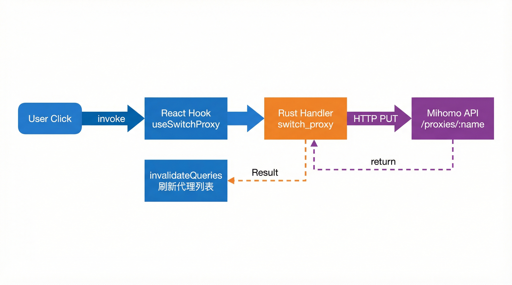
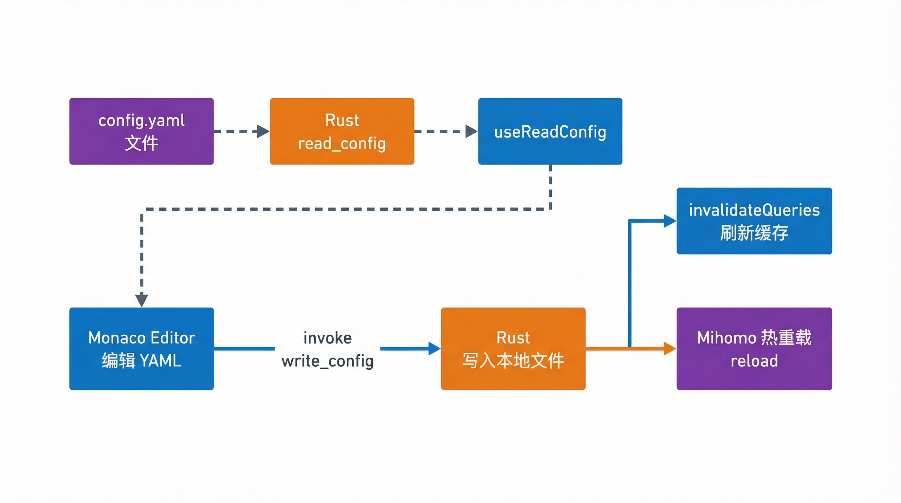
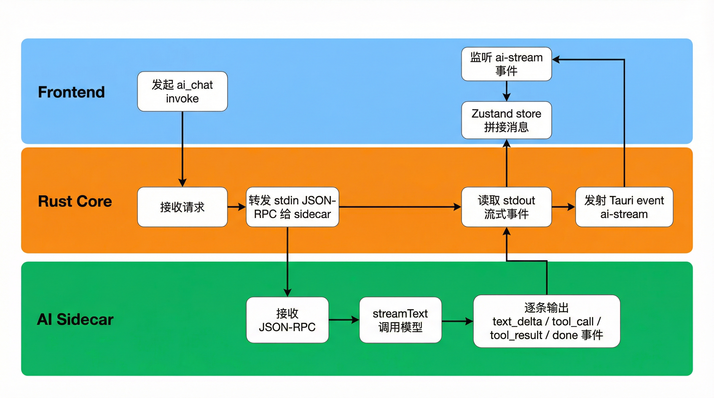
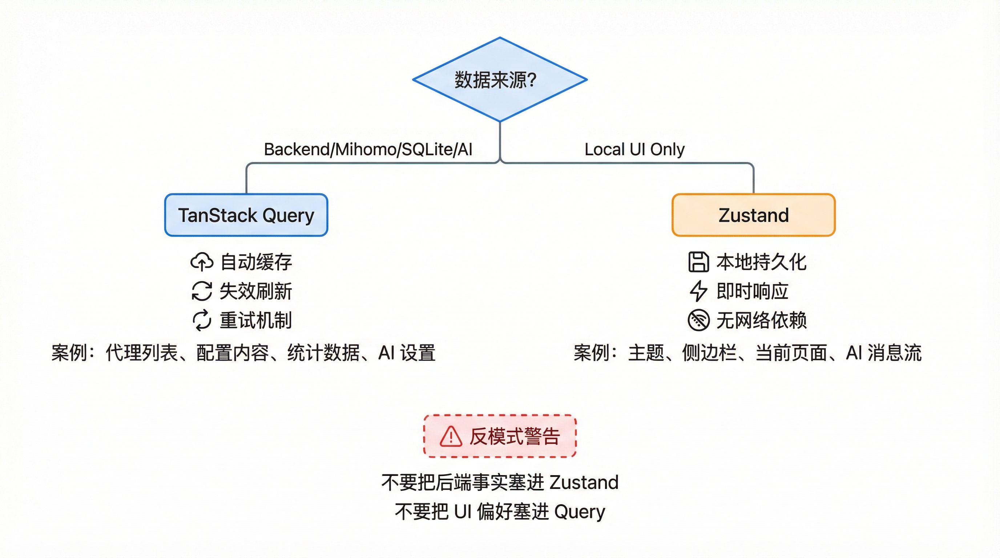
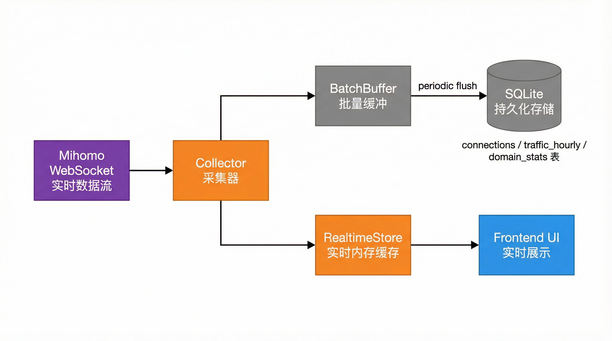

# 系统架构

这一页回答四个问题：

1. ClashMind 由哪几层组成。
2. 每一层分别负责什么，不负责什么。
3. 数据和命令在这些层之间怎么流动。
4. 为什么项目要把状态、数据库和 AI sidecar 分开设计。

如果你还没有本地跑过项目，建议先看 [快速开始](./quickstart.md)。

如果你已经知道整体定位，但不清楚 AI 这层是如何插入主链路的，可以把本页和 [AI Sidecar](./ai-service.md) 对照着看。

## 一张图理解整体结构

可以先把 ClashMind 理解成下面这个结构：

```text
┌─────────────────────────────────────────────────────────┐
│                      React WebView                      │
│                                                         │
│  features/proxy   features/config   features/ai         │
│  features/stats   features/logs     features/settings   │
│                                                         │
│  TanStack Query 负责服务端状态   Zustand 负责客户端状态  │
└──────────────────────────┬──────────────────────────────┘
                           │ invoke / event
┌──────────────────────────┴──────────────────────────────┐
│                    Rust + Tauri Core                    │
│                                                         │
│  cmd/*           core/*           db/*                  │
│  IPC 命令         sidecar/Mihomo    SQLite/migration     │
│  文件与系统能力   collector         snapshot/conversation│
└───────────────┬─────────────────────────────┬───────────┘
                │ HTTP / WS                    │ stdin/stdout JSON-RPC
┌───────────────┴──────────────┐   ┌───────────┴──────────────────────┐
│         Mihomo Sidecar       │   │        AI Service Sidecar         │
│                               │   │                                   │
│  代理、连接、流量、日志、配置  │   │  Provider 适配、工具调用、安全层 │
└───────────────────────────────┘   └───────────────────────────────────┘
```

这张图背后的重点不只是“有三层”，而是“每层只处理自己擅长的事情”。

## 三层职责划分

### 前端层：React WebView

前端层的职责是用户交互和状态展示。

它主要做这些事：

- 渲染页面和组件。
- 发起 Tauri IPC 调用。
- 监听 Tauri event。
- 管理查询缓存和 UI 状态。
- 展示配置 diff、图表、日志和表单。

它明确不做这些事：

- 不直接访问 Mihomo HTTP API。
- 不直接写本地配置文件。
- 不自行启动或管理 sidecar 进程。
- 不把敏感配置持久化到任意自定义位置。

这个约束在项目里不是口头约定，而是通过统一 API 封装和 hooks 习惯落地的。

### 中间层：Rust + Tauri

Rust 层是整个项目的中控。

它的职责包括：

- 把前端的 `invoke` 请求映射到业务命令。
- 统一管理 Mihomo sidecar 和 AI sidecar 生命周期。
- 负责读取、写入和热重载配置文件。
- 对接 Mihomo REST API 和 WebSocket。
- 把实时数据和历史聚合写入 SQLite。
- 把 AI 配置修改落成快照、文件写入和回滚。

它的边界同样清晰：

- 不负责实现前端交互。
- 不直接承担模型 SDK 与工具调用的复杂逻辑。
- 不把 AI 相关逻辑硬塞进 Tauri 主进程。

### 外部执行层：Mihomo 与 AI sidecar

最外层有两个独立进程。

Mihomo sidecar 负责代理内核本身。

AI sidecar 负责所有模型相关工作，包括：

- Provider 适配。
- JSON-RPC 请求处理。
- Function Calling 工具集。
- 配置脱敏、校验和 diff 预览。

这样拆的直接收益是：

- Mihomo 崩溃时，主应用仍有机会感知和恢复。
- AI SDK 升级不会直接污染 Rust 主进程。
- 不同进程的职责和依赖更容易测试与替换。

:::tip 为什么不用前端直连所有能力
从实现角度看，前端当然也可以直接请求 Mihomo API。

但那会把地址、密钥、配置路径、系统代理权限和文件写入逻辑都泄漏到 UI 层。

ClashMind 选择 Rust 层做统一中控，是为了把安全边界和平台能力收拢到一个地方。
:::

## 目录结构与模块边界

### `src/`：前端应用

前端源码大体上按“业务 feature + 公共能力”组织。

最值得关注的目录有：

| 目录 | 作用 |
|------|------|
| `src/features/` | 按业务划分的功能模块 |
| `src/components/` | 通用 UI 与布局组件 |
| `src/hooks/` | 全局 hooks |
| `src/lib/` | IPC API、常量、通用工具 |
| `src/stores/` | Zustand 状态 |
| `src/i18n/` | 语言资源 |

Feature 目录不是按页面 URL 生切，而是按领域切分：

- `proxy`
- `connections`
- `rules`
- `logs`
- `config`
- `stats`
- `ai`
- `settings`

这样做的好处是，业务相关的组件、hooks 和交互逻辑更容易聚在一起演进。

### `src-tauri/src/`：Rust 后端

Rust 侧大致可以分为四组：

| 目录 | 作用 |
|------|------|
| `cmd/` | 暴露给前端的 IPC 命令 |
| `core/` | Sidecar、Mihomo、系统代理等核心逻辑 |
| `collector/` | WebSocket 采集、批量缓冲、实时缓存 |
| `db/` | migration 与 repository |

这里最重要的一个设计点是：

前端只应该知道命令名和返回类型。

真正的网络、数据库、进程和文件细节都藏在 `core/`、`collector/` 和 `db/` 下面。

### `ai-service/src/`：AI sidecar

AI 侧则按 AI 工作流的职责拆分：

| 目录 | 作用 |
|------|------|
| `index.ts` | stdin 监听与启动 ready 信号 |
| `rpc-handler.ts` | JSON-RPC 请求分发和流式输出 |
| `providers/` | 模型 Provider 适配 |
| `tools/` | Function Calling 工具 |
| `safety/` | 脱敏、Schema 校验、Diff 生成 |
| `prompts/` | 系统提示词与报告提示词 |

如果你需要继续深入 AI 相关内容，建议直接跳到 [AI Sidecar](./ai-service.md)。

## 真实数据流：从 UI 到 Mihomo

### 流 1：代理切换



代理切换是最能说明边界的一条链路。

前端不会直接调 Mihomo 的 `/proxies/:name`。

而是走统一的 hook：

```ts
const PROXY_KEYS = { all: ["proxies"] as const };

export function useProxies() {
  return useQuery({ queryKey: PROXY_KEYS.all, queryFn: api.proxy.getAll });
}

export function useSwitchProxy() {
  const qc = useQueryClient();
  return useMutation({
    mutationFn: ({ group, name }: { group: string; name: string }) =>
      api.proxy.switch(group, name),
    onSuccess: () => qc.invalidateQueries({ queryKey: PROXY_KEYS.all }),
  });
}
```

这段代码揭示了三个规则：

1. 读取状态用 `useQuery`。
2. 变更动作用 `useMutation`。
3. 成功后失效对应 query，让界面和后端重新同步。

后续的事情才是 Rust 去处理：

1. 接收 `switch_proxy` 命令。
2. 调用 Mihomo HTTP API。
3. 返回结果给前端。

### 流 2：配置编辑与热重载



配置编辑的链路比代理切换更长，因为它涉及本地文件。

前端同样只持有一个很薄的调用层：

```ts
const CONFIG_KEYS = { read: (path: string) => ["config", path] as const };

export function useReadConfig(path: string) {
  return useQuery({
    queryKey: CONFIG_KEYS.read(path),
    queryFn: () => api.config.read(path),
    enabled: !!path,
  });
}

export function useWriteConfig() {
  const qc = useQueryClient();
  return useMutation({
    mutationFn: ({ path, content }: { path: string; content: string }) =>
      api.config.write(path, content),
    onSuccess: (_data, vars) =>
      qc.invalidateQueries({ queryKey: CONFIG_KEYS.read(vars.path) }),
  });
}
```

真正的流程是：

1. Rust 读取本地配置文件。
2. 前端把文本交给 Monaco Editor。
3. 用户修改后，前端再次通过 IPC 交给 Rust。
4. Rust 写入文件并触发 Mihomo 配置热重载。

这条链路里最重要的不是“能改 YAML”，而是“文件写入和运行时重载都由同一层负责”，因此更容易保证一致性。

### 流 3：AI 对话与流式事件



AI 链路再多一层 sidecar。

前端 hook 的入口仍然很薄：

```ts
const sendMessageMutation = useMutation<void, Error, string>({
  mutationFn: async (rawInput) => {
    const content = rawInput.trim();
    const settings = await resolveAiProviderSettings();

    const params: AiChatParams = {
      messages: conversation,
      settings,
    };

    await ensureAiServiceRunning();
    await api.ai.chat(params);
  },
});
```

但这条链路背后实际发生的是：

1. 前端通过 `invoke("ai_chat")` 请求 Rust。
2. Rust 把请求转发给 AI sidecar。
3. AI sidecar 调模型、执行工具并逐步输出流式事件。
4. Rust 把这些事件发回前端的 `ai-stream`。
5. 前端的 Zustand store 逐条拼接消息和工具结果。

这就是为什么 AI 对话既能实时流式展示文本，也能在同一条消息里显示工具调用与待确认 diff。

## 状态管理策略

ClashMind 没有把所有状态混在一个 store 里。

而是把“服务端状态”和“客户端状态”明确拆开。

### TanStack Query：面向后端事实

凡是来自 Mihomo、Rust、SQLite 或 AI IPC 的数据，优先用 TanStack Query 管。

典型例子包括：

- 代理列表
- 当前配置文件内容
- 统计数据
- AI 设置
- 快照列表

这样做有三个收益：

- 请求和缓存生命周期清晰。
- 刷新、失效、重试都能统一处理。
- 不需要手写大量同步逻辑。

### Zustand：面向本地 UI 状态

凡是“只对当前前端会话有意义”的状态，则放到 Zustand。

例如全局应用 store：

```ts
export const useAppStore = create<AppState>()(
  persist(
    (set) => ({
      theme: "system",
      sidebarCollapsed: false,
      currentPage: "proxies",
      mihomoConfigDir: DEFAULT_CONFIG_DIR,
      apiAddress: MIHOMO_DEFAULT_ADDRESS,
      apiSecret: "",
      setTheme: (theme) => set({ theme }),
      toggleSidebar: () => set((s) => ({ sidebarCollapsed: !s.sidebarCollapsed })),
    }),
    {
      name: "clashmind-store",
    },
  ),
);
```

这类状态不适合丢进 Query，因为它们不是“从后端拉回来的事实”，而是界面本地偏好和交互状态。

AI 会话也有独立 store，专门管理：

- 当前消息列表
- 流式中消息 ID
- 工具调用状态
- 待确认的配置变更 payload

因此整体原则可以记成一句话：

> 后端事实走 Query，本地交互走 Zustand。



## 数据库设计概览

SQLite 并不是只拿来存一个“设置表”。

它承担了统计分析和 AI 工作流中多个关键数据集的持久化职责。

从 `migration.rs` 看，当前主要表包括：

| 表名 | 作用 |
|------|------|
| `connections` | 连接生命周期与上传下载记录 |
| `traffic_hourly` | 小时级流量聚合 |
| `traffic_daily` | 天级流量聚合 |
| `domain_stats` | 域名统计 |
| `geoip_cache` | IP 到地理信息缓存 |
| `traffic_samples` | 更细粒度的流量样本 |
| `rule_stats` | 规则命中统计 |
| `ip_traffic_daily` | 目标 IP 的天级流量 |
| `config_snapshots` | 配置快照 |
| `ai_conversations` | AI 会话历史 |

这套表结构说明项目的数据关注点并不单一。

它既关心：

- 运行时的即时状态

也关心：

- 用于分析和回溯的历史数据

真实 migration 里可以看到后两张和 AI 工作流直接相关的表：

```rust
CREATE TABLE IF NOT EXISTS config_snapshots (
    id          INTEGER PRIMARY KEY AUTOINCREMENT,
    content     TEXT NOT NULL,
    source      TEXT NOT NULL,
    description TEXT,
    file_path   TEXT,
    created_at  TEXT NOT NULL DEFAULT (datetime('now'))
);

CREATE TABLE IF NOT EXISTS ai_conversations (
    id          INTEGER PRIMARY KEY AUTOINCREMENT,
    role        TEXT NOT NULL,
    content     TEXT NOT NULL,
    tool_calls  TEXT,
    tokens_used INTEGER,
    model       TEXT,
    created_at  TEXT NOT NULL DEFAULT (datetime('now'))
);
```

这两张表的存在意味着：

- AI 改配置之前可以留下快照。
- AI 对话与工具调用摘要可以沉淀为历史记录。

这就是 AI 功能之所以能被当作“工作流”而不是“一次性文本输出”的基础。

## Collector、BatchBuffer 与 RealtimeStore



除了 SQLite，项目还保留了两类中间数据结构：

- 批量缓冲
- 实时内存缓存

这样做是因为某些数据流，比如连接和流量，是高频实时更新的。

如果每次变化都立即打到数据库，会带来不必要的写入放大。

所以系统采用的是：

1. WebSocket 先接收实时数据。
2. 写入 `BatchBuffer` 做批量缓冲。
3. 同时同步到 `RealtimeStore` 作为最新视图。
4. 周期性 flush 到 SQLite。

这也是为什么统计页能同时兼顾：

- 当前时刻的响应速度
- 历史数据的查询能力

## 为什么前端不直连 Mihomo

这个问题值得单独说一次，因为它决定了很多代码习惯。

如果前端直连 Mihomo，看起来似乎更简单。

但会立即带来几个问题：

- API 地址与密钥暴露给 UI 层更多位置。
- 文件路径、配置读写和系统代理能力无法统一控制。
- 桌面平台能力和 Web 前端逻辑耦合。
- AI 工具如果也需要读取运行状态，会出现多套访问路径。

当前架构通过 Rust 层中控，把这些问题统一收口：

- Mihomo HTTP/WS 访问从 Rust 出口走。
- 配置文件读写从 Rust 出口走。
- AI sidecar 回调也从 Rust 出口走。
- 前端只保留“请求某项能力”的抽象。

这会多一层代码，但换来的是更稳的边界。

:::warning 不要把“方便”误解成“应该”
在这个项目里，前端直接调 Mihomo API 往往不是快捷方式，而是越过边界。

一旦这么做，后续的权限、安全、重试、快照和日志链路都会开始分叉。
:::

## 继续阅读

现在你应该已经能把 ClashMind 看成一个层次清楚的桌面系统：

- `src/` 负责交互和展示
- `src-tauri/src/` 负责系统中控
- `ai-service/src/` 和 Mihomo sidecar 负责外部执行

如果你接下来关注 AI 这条链路，继续看 [AI Sidecar](./ai-service.md)。

如果你准备直接开始改代码，继续看 [开发指南](./development.md)。
